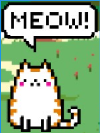

# GDD - Game Design Document - Módulo 1 - Inteli

## BIGODE'S

#### Nomes dos integrantes do grupo
- João de Caprio Agmont
- Paulo Vitor Barros de Almeida
- Isabela Rosati Peçanha
- Reimar Coelho Ferreira Filho
- Cauê Meyer Taddeo
- Thúlio Sallum Bacco Pinto
- Mariana Pereira de Souza
- Henrique Rodrigues Diniz

## Sumário

[1. Introdução](#c1)

[2. Visão Geral do Jogo](#c2)

[3. Game Design](#c3)

[4. Desenvolvimento do Jogo](#c4)

[5. Casos de Teste](#c5)

[6. Conclusões e trabalhos futuros](#c6)

[7. Referências](#c7)

[Anexos](#c8)

 

# 1. Introdução (sprints 1 a 4)

## 1.1. Plano Estratégico do Projeto
- *Obs: todas as fontes utilizadas estão na seção 7.*

### 1.1.1. Contexto da indústria (sprint 2)

*O mercado de comportamento e adestramento animal tem crescido com a alta demanda por métodos positivos. Os principais players incluem influenciadores, como Dr. Pet, Cesar Millan e Ian Dunbar, além de plataformas educacionais e empresas de produtos para pets. Os modelos de negócio variam entre consultorias, cursos online e assinaturas. Já as tendências no setor de cuidado de pets abrem margens para a gamificação e tecnologia. Alexandre Rossi busca inovação e diferenciação da concorrência ao abranger áreas de atuação como a mídia tradicional e as redes sociais, bem como a possível entrada no mercado de jogos digitais para animais domésticos. [1][2]*

#### 1.1.1.1. Modelo de 5 Forças de Porter (sprint 2)

*As 5 Forças de Porter são um modelo estratégico desenvolvido por Michael Porter, professor da Harvard Business School, na década de 1970. Este framework é amplamente utilizado para analisar a competitividade em um setor de negócios, identificando as principais forças que influenciam o ambiente competitivo de uma empresa. Ao analisar essas forças, é possível desenvolver estratégias eficazes para melhorar a posição competitiva da empresa no mercado. Sendo assim, a imagem a seguir apresenta a análise da indústria de comportamento e bem-estar de animais, a fim de averiguar como a marca Dr Pet se posiciona nesse setor. [3][4][6]*

 Figura X - 5 Forças de Porter

Fonte: Material produzido pelos autores (2025)

### 1.1.2. Análise SWOT (sprint 2)

*A análise SWOT é uma ferramenta estratégica que avalia o cenário interno e externo de uma empresa, identificando forças e fraquezas internas, além de oportunidades e ameaças externas. Isso inclui análises de mercado, concorrentes, fornecedores e contextos políticos, econômicos, sociais e culturais. Na figura, apresentamos a análise SWOT centrada na marca Dr Pet. [3][4][5]*

Figura X - Análise SWOT

Fonte: Material produzido pelos autores (2025)

*A Dr. Pet se posiciona como uma marca consolidada e referência no mercado pet, apoiando-se na credibilidade de Alexandre Rossi e sua forte presença digital. No que tange à concorrência com influenciadores e métodos tradicionais de adestramento, é exigido diferenciação contínua para se destacar. Nesse contexto, sua presença em diferentes ambientes de influência, como redes sociais, mídias tradicionais e literatura educativa, coloca-a em vantagem em relação a seus oponentes. Oportunidades como a crescente demanda por adestramento positivo e a digitalização do setor podem fortalecer sua posição. Contudo, mudanças em algoritmos e regulações representam ameaças que exigem adaptação constante.*

### 1.1.3. Missão / Visão / Valores (sprint 2)

*A análise de Missão, Visão e Valores é uma ferramenta estratégica fundamental para qualquer empresa, pois ajuda a definir sua identidade e propósito. A Missão descreve o que a empresa faz atualmente, para quem ela trabalha e qual é seu objetivo principal. Ela serve como um guia para as operações diárias e define o papel da empresa no mercado. A Visão, por outro lado, estabelece o objetivo futuro, indicando onde a empresa deseja chegar a longo prazo. Ela inspira e motiva os funcionários a trabalhar em direção a um objetivo comum, ajudando a direcionar as estratégias e decisões da empresa. [7]*

*Os Valores representam os princípios éticos e morais que guiam as ações e decisões da empresa. Eles influenciam a cultura organizacional e são essenciais para construir confiança com clientes, funcionários e parceiros.*

*Essa análise é crucial para que as empresas mantenham uma direção clara e coerente, alinhando suas operações com seus objetivos e princípios. Dessa forma, esses fundamentos podem ser descritos para a marca Dr Pet da seguinte forma:*

*Missão: democratizar o acesso aos serviços veterinários e de adestramentos para que os pets desfrutem do direito a uma vida tranquila e saudável.*

*Visão: expandir a atuação através de serviços de qualidade que proporcionam uma experiência sempre positiva para os tutores e pets.*

*Valores: excelência com simplicidade, credibilidade na transparência, atendimento com respeito e ética, ser sustentável em todos os aspectos.*

### 1.1.4. Proposta de Valor (sprint 4)

*Posicione aqui o canvas de proposta de valor. Descreva os aspectos essenciais para a criação de valor da ideia do produto com o objetivo de ajudar a entender melhor a realidade do cliente e entregar uma solução que está alinhado com o que ele espera.*

### 1.1.5. Descrição da Solução Desenvolvida (sprint 4)

*Descreva brevemente a solução desenvolvida para o parceiro de negócios. Descreva os aspectos essenciais para a criação de valor da ideia do produto com o objetivo de ajudar a entender melhor a realidade do cliente e entregar uma solução que está alinhado com o que ele espera. Observe a seção 2 e verifique que ali é possível trazer mais detalhes, portanto seja objetivo aqui. Atualize esta descrição até a entrega final, conforme desenvolvimento.*

### 1.1.6. Matriz de Riscos (sprint 4)

*Registre na matriz os riscos identificados no projeto, visando avaliar situações que possam representar ameaças e oportunidades, bem como os impactos relevantes sobre o projeto. Apresente os riscos, ressaltando, para cada um, impactos e probabilidades com plano de ação e respostas.*

### 1.1.7. Objetivos, Metas e Indicadores (sprint 4)

*Definição de metas SMART (específicas, mensuráveis, alcançáveis, relevantes e temporais) para seu projeto, com indicadores claros para mensuração*

## 1.2. Requisitos do Projeto (sprints 1 e 2)

Tabela X

\# | Requisitos Fundamentais do Jogo
--- | ---
1 | O jogo deve ser publicável nas principais lojas de aplicativos
2 | O jogo deve funcionar em dispositivos móveis, como celulares e tablets
3 | O dispositivo móvel deve interpretar o toque da pata de gatos
4 | A descrição do jogo deve explicitar que ele é voltado para gatos
5 | O jogo deve apresentar responsividade para ter aparência adequada em diferentes tamanhos de tela
6 | O jogo deve indicar com clareza que o tutor é essencial para a jogabilidade
7 | Os elementos gráficos devem ser esticamente agradáveis ao público-alvo (humanos)
8 | O jogo deve indicar que o tutor deve preparar com antecedência petiscos para recompensar o gato
9 | O jogo deve apresentar diferentes fases que representam diferentes níveis de complexidade
10 | O jogo deve possuir uma interface intuitiva que mostre claramente que o jogo é estruturado em fases
11 | O tutor deve conseguir selecionar a fase que deseja que o gato jogue
12 | Após o tutor selecionar uma fase, deve aparecer uma pequena explicação sobre ela antes do jogo iniciar
13 | A primeira fase deve ser simples e introduzir as principais mecânicas do jogo
14 | O jogo deve apresentar um alvo que se comporte de modo a capturar a atenção do gato
15 | Os elementos gráficos do jogo devem apresentar cores visíveis para gatos
16 | Os alvos devem possuir cores que se destacam na visão dos gatos em relação aos outros elementos
17 | O alvo deve ser capaz de estimular os instintos de caça do gato
18 | O jogo deve apresentar estímulos visuais quando o gato tocar corretamente o alvo
19 | O jogo deve apresentar estímulos de sons de alta frequência quando o gato tocar corretamente o alvo
20 | O jogo deve apresentar vibração da tela quando o gato tocar corretamente o alvo
21 | O jogo deve apresentar opções de ativar ou desativar as mecânicas de som e vibração
22 | O background do jogo deve ser simples para não confundir o gato
23 | Os alvos devem ser "destruídos" após uma determinada quantidade pequena de toques 
24 | A quantidade de toques necessária para destruir o alvo deve progredir lentamente de acordo com as fases
25 | O jogo deve mostrar uma tela que indica que é o momento de recompensar o gato após todos os alvos serem destruídos
26 | O jogo deve fazer o gato associar a destruição dos alvos à recompensa
27 | O jogo deve indicar que o petisco deve ser posicionado na posição do último alvo destruído

Fonte: Material produzido pelos autores (2025)

Tabela X

\# | Requisitos Desejáveis do Jogo
--- | ---
1 | O jogo deve apresentar uma mecânica nova para o alvo a cada fase
2 | As novas mecânicas devem desafiar cada vez mais as habilidades de caça do gato
3 | A mecâcina opcional do tutor controlar o alvo deve ser introduzida a fim de promover ainda mais interação entre tutor e pet
4 | O jogo deve apresentar a função de conectar dois dispositivos em uma mesma fase
5 | O jogo deve apresentar a função de um dispositivo atuar como controle remoto de um alvo que está em outro dispositivo

Fonte: Material produzido pelos autores (2025)

## 1.3. Público-alvo do Projeto (sprint 2)

*O jogo tem como público-alvo todos os donos de gatos que buscam formas inovadoras de entretenimento e estímulo para seus pets, especialmente aqueles que vivem em ambientes urbanos e utilizam tecnologia no dia a dia. Foi desenvolvido para proporcionar uma experiência interativa entre gatos e seus tutores, promovendo o enriquecimento ambiental e fortalecendo o vínculo entre ambos. Ao abranger esse público, independentemente da idade ou nível de experiência com tecnologia, busca-se garantir que os gatos tenham acesso a um jogo envolvente e adequado ao seu comportamento natural, enquanto os donos desfrutam de uma solução prática e intuitiva para estimular seus animais. O objetivo é incentivar momentos de diversão compartilhada, melhorar o bem-estar dos felinos e oferecer uma alternativa acessível e inovadora dentro do universo digital.*

# 2. Visão Geral do Jogo (sprint 2)

## 2.1. Objetivos do Jogo (sprint 2)

*O jogador (gato) deve tocar no alvo presente na tela, com o objetivo de "destruí-lo" para ser recompensado, conforme o jogador completa as fases, o processo de recompensa fica mais complexo.*

## 2.2. Características do Jogo (sprint 2)
*O jogo pode ser decrito com cinco características principais que marcam sua jogabilidade:*
- O jogo apresenta cinco fases;
- Cada nova fase apresenta alvos com movimentação mais rápida e padrões mais complexos;
- A cada fase, um novo desafio ou elemento é introduzido;
- Há animações ou efeitos especiais que ajudam a manter o jogador imerso;
- O jogador é recompensado pelo tutor após concluir com êxito uma fase.

### 2.2.1. Gênero do Jogo (sprint 2)

*Jogo para gato.*

### 2.2.2. Plataforma do Jogo (sprint 2)

*Quanto ao dispositivo: smartphones e tablets.*

*Quanto ao sistema: disposítivos móveis que interpretam touch screen.*

### 2.2.3. Número de jogadores (sprint 2)

*1 ou 2 jogadores.*

### 2.2.4. Títulos semelhantes e inspirações (sprint 2)

*Temos como títulos semelhantes e inspirações os seguintes jogos: "Cat Toy 2", "Jogos para Gatos", "Meow jogos Para Gatos Filhotes".*

### 2.2.5. Tempo estimado de jogo (sprint 5)

*Ex. O jogo pode ser concluído em 3 horas passando por todas as fases.*

*Ex. cada partida dura até 15 minutos*

# 3. Game Design (sprints 2 e 3)

## 3.1. Enredo do Jogo (sprints 2 e 3)

*Nosso jogo é focado em gatos e possui uma mecânica simples de tocar em alvos para ganhar pontos, então ele não precisa de um enredo tradicional. Sendo assim, os seguintes motivos explicitam o motivo pelo qual não há um enredo em nosso jogo:*
- Foco na Jogabilidade Simples – O objetivo principal é a interação direta do gato com os alvos, sem necessidade de narrativa para motivação;
- Público-Alvo (Gatos) – Gatos não precisam de enredo para engajamento, eles reagem a estímulos visuais e movimentos instintivamente;
- Experiência Imediata – O jogo precisa ser intuitivo e direto, sem introduções ou explicações complexas.

## 3.2. Personagens (sprints 2 e 3)

### 3.2.1. Controláveis

*Nosso jogo não possui personagens controláveis pelos seguintes motivos:*
- O jogo não apresenta avatares ou personagens fictícios durante a jogatina, o próprio gato interage diretamente com os elementos na tela;
- O jogo é projetado para estimular o instinto de caça do gato, utilizando movimentos e efeitos visuais que incentivam a interação;
- Diferente de jogos com narrativa, o jogo é um ambiente interativo para o animal;
- O gato vê os alvos como presas ou brinquedos, tornando a experiência instintiva e envolvente sem a necessidade de um personagem controlável.

### 3.2.2. Non-Playable Characters (NPC)

*Nosso único personagem se chama Canela, ele é um gatinho que instruirá o tutor sobre como se jogar. Ele acompanhará o tutor e o gato no tutorial, estará presente na tela de níveis e explicará as mecanicas presentes em diferentes fases, servindo de auxilio para facilitar a gameplay.*

  Concept Art do Canela  
   
  
    
  Fonte: Material produzido pelos autores (2025)

### 3.2.3. Diversidade e Representatividade dos Personagens

  *O jogo foi projetado para ser acessível tanto para os gatos quanto para os humanos, garantindo que a experiência seja envolvente e inclusiva. Para isso, foram consideradas diversas adaptações para daltônicos e surdos, garantindo que ninguém fique excluído da jogabilidade.*

 1. Acessibilidade para Daltônicos: 
  Os gatos enxergam predominantemente tons de azul e amarelo, enquanto os humanos daltônicos podem ter dificuldade em distinguir certas cores. Para tornar o jogo acessível:  
- Uso de cores contrastantes e amigáveis para gatos e humanos (ex: amarelo e azul em vez de verde e vermelho).  
- Padrões e texturas diferentes nas patas para ajudar na distinção sem depender apenas da cor.  
- Feedback visual com animações e efeitos luminosos para indicar interações bem-sucedidas.  

 2. Acessibilidade para Surdos:
  Como o jogo utiliza sons para recompensar o gato e o jogador, foram adicionadas alternativas visuais para tornar a experiência acessível para surdos:  
- Sinais visuais de reforço positivo (ex: brilhos, pequenas vibrações na tela e mudanças de cor ao acertar a pata).  
- Ícones e expressões do Miau-trutor para substituir comandos sonoros, garantindo que as instruções sejam compreendidas visualmente.  

## 3.3. Mundo do jogo (sprints 2 e 3)

### 3.3.1. Locações Principais e/ou Mapas (sprints 2 e 3)

*Descreva o ambiente do jogo, em que locais ele ocorre. Ilustre com imagens. Se houverem mapas, posicione-os aqui, descrevendo as áreas em acordo com o enredo. Se houverem fases, descreva-as também em acordo com o enredo (pode ser um jogo de uma fase só). Utilize listas ou tabelas para organizar esta seção. Caso utilize material de terceiros em licença Creative Commons, não deixe de citar os autores/fontes.*

### 3.3.2. Navegação pelo mundo (sprints 2 e 3)

*Descreva como os personagens se movem no mundo criado e as relações entre as locações – como as áreas/fases são acessadas ou desbloqueadas, o que é necessário para serem acessadas etc. Utilize listas ou tabelas para organizar esta seção.*

### 3.3.3. Concept Art (sprint 2)

*Uma concept art é a essência visual de uma ideia, ela explica a atmosfera onde o jogo se passará, os personagens presentes e as fases. Ele será um reflexo de nosso processo criativo, evidenciando que passos tomamos para a criação do design de nosso jogo. O link abaixo apresenta um arquivo que aborda o processo da criação das concepts arts do nosso jogo.*

- https://www.figma.com/design/cVbJo00x8BpZQIv578cxQV/Figma-basics?m=dev&t=5ewIVfxGBBk5PlOo-1

### 3.3.4. Trilha sonora (sprint 3)

  A trilha sonora de um jogo é tão essencial quanto a própria jogabilidade, uma vez que influencia as emoções dos jogadores, fazendo-os criar uma conexão com o jogo. Portanto ao selecionar os áudios e efeitos sonoros, foram tomados cuidados extras, para não prejudicar a concepção do jogo e ornando com a proposta do mesmo.
  Ao pensar sobre a trilha sonora, destacou-se a preferência por algo mais chamativo, a fim de "dar a cara" para o jogo através da unicidade da música. Foi decidido também a adição de efeitos sonoros para certas funcionalidades, como: clique dos botôes (configuração, play, etc...), destruição da pata e da pata se movimentando.

\# | titulo | ocorrência | autoria 
--- | --- | --- | ---
1 | "Vacation with my cat" | Trilha principal | <a href = "https://pixabay.com/music/upbeat-vacation-with-my-cat-248359/"> pixabay (AI generated) </a>
2 | Light Switch | Clique dos botões | <a href = "https://freesound.org/people/GOSFX/sounds/324334/"> freesound </a>
3 | "meow meow give me milk Version 1" | Trilha sonora da seleção de fases | <a href = "https://pixabay.com/pt/music/musicas-felizes-para-criancas-meow-meow-give-me-milk-version-1-317260/"> pixabay </a>
4 | "me dá me dá" - piano cover | XXXXXXXXXXXX | cover da propaganda do 'danoninho' ("me dá me dá")
5 | TIN | Clique na pata | autoral
6 | Prato de bateria | XXXXXXXXXXXXXX | autoral
7 | Botão de elevador | Clique dos botões | autoral
8 | Folhas | Esconderijo da pata | autoral
9 | "Saquê do Bink" - piano cover | Pata se movimentando | cover influcenciado pela música "Binks no Sake" (One Piece)
10 | Chocalho | XXXXXXXXXX | autoral

## 3.4. Inventário e Bestiário (sprint 3)

### 3.4.1. Inventário

*\<opcional\> Caso seu jogo utilize itens ou poderes para os personagens obterem, descreva-os aqui, indicando títulos, imagens, meios de obtenção e funções no jogo. Utilize listas ou tabelas para organizar esta seção. Caso utilize material de terceiros em licença Creative Commons, não deixe de citar os autores/fontes.* 

*Exemplo de tabela*
\# | item |  | como obter | função | efeito sonoro
--- | --- | --- | --- | --- | ---
1 | moeda |  | há muitas espalhadas em todas as fases | acumula dinheiro para comprar outros itens | som de moeda
2 | madeira |  | há muitas espalhadas em todas as fases | acumula madeira para construir casas | som de madeiras
3 | ... 

### 3.4.2. Bestiário

*\<opcional\> Caso seu jogo tenha inimigos, descreva-os aqui, indicando nomes, imagens, momentos de aparição, funções e impactos no jogo. Utilize listas ou tabelas para organizar esta seção. Caso utilize material de terceiros em licença Creative Commons, não deixe de citar os autores/fontes.* 

*Exemplo de tabela*
\# | inimigo |  | ocorrências | função | impacto | efeito sonoro
--- | --- | --- | --- | --- | --- | ---
1 | robô terrestre |  |  a partir da fase 1 | ataca o personagem vindo pelo chão em sua direção, com velocidade constante, atirando parafusos | se encostar no inimigo ou no parafuso arremessado, o personagem perde 1 ponto de vida | sons de tiros e engrenagens girando
2 | robô voador |  | a partir da fase 2 | ataca o personagem vindo pelo ar, fazendo movimento em 'V' quando se aproxima | se encostar, o personagem perde 3 pontos de vida | som de hélice
3 | ... 

## 3.5. Gameflow (Diagrama de cenas) (sprint 2)

*Um diagrama de cenas para um jogo representa visualmente a transição entre diferentes telas ou estados, como menus, fases e cutscenes. Ele auxilia no planejamento da navegação, garantindo uma experiência fluida para o jogador e facilitando a organização do desenvolvimento. O link abaixo contém um arquivo que apresenta o diagrama de cenas do nosso jogo.*

- https://www.figma.com/design/luhoZeSsvZhyLUqD8fNmj2/Figma-basics?node-id=1669-162202&m=dev&t=ip24dGcWd0Ux4PSl-1*

## 3.6. Regras do jogo (sprint 3)

As regras do jogo definem o início, o progresso dos jogadores, as ações possíveis e o desfecho do jogo, sendo fundamentais para garantir que o usuário entenda com clareza a jogabilidade e, assim, tenha uma boa experiência ao jogar. Desse modo, foram estabelecidas as seguintes regras para o jogo "Paw Dash":

- O usuário deve concluir as fases de modo que, após ter êxito na primeira, poderá jogar a segunda, e assim por diante;
- O 

O jogador (o gato) deve acertar corretamente as patas que aparecem na tela para avançar para a próxima fase. No início, as patas são grandes e estáticas, facilitando o acerto, mas conforme o jogo avança, elas se tornam menores, se dividem e surgem obstáculos que dificultam a precisão dos toques. O progresso só poderá ser feito quando o número necessário de acertos for atingido. Ao completar a fase, o tutor (dono do gato) deve oferecer um petisco real como recompensa, reforçando positivamente a interação e tornando o jogo uma experiência ainda mais envolvente para ambos. 

## 3.7. Mecânicas do jogo (sprint 3)

No jogo, o jogador(gato) interage tocando na tela do iPad com a pata para acertar as marcas de pegadas. O gato utilizará toques na tela para interagir com os elementos do jogo. Cada toque correto reduz o tamanho da pata ou a divide em novas pegadas menores, aumentando a dificuldade progressivamente. Caso o gato toque fora da pata, nenhuma ação ocorre, incentivando novas tentativas.

## 3.8. Implementação Matemática de Animação/Movimento (sprint 3)

*Descreva aqui a função que implementa a movimentação/animação de personagens ou elementos gráficos no seu jogo. Sua função deve se basear em alguma formulação matemática (e.g. fórmula de aceleração). A explicação do funcionamento desta função deve conter notação matemática formal de fórmulas/equações. Se necessário, crie subseções para sua descrição.*

# 4. Desenvolvimento do Jogo

## 4.1. Desenvolvimento preliminar do jogo (sprint 1)

*Para a primeira versão do jogo em termos de código, selecionamos as mecânicas e dinâmicas mais importantes da jogabilidade, bem como alguns elementos cruciais da estética escolhida, como o modelo de uma pata (alvo principal do gato) em pixel art, para desenvolver uma tela que demonstra a essência do nosso projeto. Desse modo, as etapas desenvolvidas preliminarmente, bem como os desafios encontrados e a projeção para o futuro do projeto, podem ser definidos pelos tópicos seguintes.*

### **4.1.1. Estética**

Para compor os elementos estéticos iniciais do nosso jogo, desenvolvemos em pixel art a representação de uma pata de gato (figura 1), que atua no jogo como alvo tocável para o gato usuário. Ademais, foi selecionado um background que consiste na representação de uma parede de madeira (figura 2).

  Figura 1 - Pata desenvolvida em pixel art  
   
  
    
  Fonte: Material produzido pelos autores (2025)

  Figura 2 - Background de Madeira  
   
  
    
  Fonte: Imagem em Domínio Público

### **4.1.2. Mecânicas**

As principais mecânicas elaboradas no primeiro estágio de desenvolvimento do jogo foram as seguintes:
- A pata se move verticalmente e horizontalmente através da tela e muda de direção sempre que colide com uma “parede”;
- A pata é clicável, reage diminuindo de tamanho a cada clique e aumenta de velocidade ao atingir um tamanho mínimo pré definido;
- O número de cliques bem sucedidos é contabilizado e mostrado na tela;
- O background se adapta de acordo com o tamanho da tela onde o jogo está sendo jogado.

### **4.1.3 Dificuldades Encontradas**

Os principais desafios encontrados durante o desenvolvimento do jogo foram os seguintes:
- Dificuldade em captar precisamente os cliques na tela, o que pode ser um empecilho, haja vista que os toques dos gatos podem ser suaves e não serem captados adequadamente para uma jogabilidade fluída; 
- Dificuldade em configurar a pata para que ela se divida após um número determinado de cliques, o que é uma das mecânicas principais pensadas para o jogo;
- Desconhecimento sobre a real capacidade de nosso jogo de captar a atenção de felinos, de modo que não temos certeza se nossa abordagem irá ser efetiva em primeira análise.

### 4.1.4 Próximos passos

Pensando nas próximas etapas de desenvolvimento do nosso projeto, os próximos passos planejados para serem executados nos próximos Sprints são os seguintes:
- Otimizar a mecânica de capturar toques na tela e testar seu funcionamento em dispositivos móveis;
- Desenvolver uma tela que instrua o tutor a recompensar o gato de acordo com seu sucesso e de maneira adequada;
- Adicionar sons e efeitos visuais envolventes para otimizar a capacidade de engajar os usuários;
- Testar a jogabilidade com um grupo de gatos para coletar feedback para ajustes;
- Desenvolver a tela inicial do jogo, a tela de seleção de fases, bem como as demais funcionalidades para tornar nosso aplicativo completo;
- Adicionar funcionalidades diferenciais para atender o requisto de proporcionar uma experiência inovadora e cativante entre tutor e animal.

## 4.2. Desenvolvimento básico do jogo (sprint 2)

*Para a versão básica do jogo em termos de código, focamos em desenvolver as mecânicas e dinâmicas referentes a primeira fase do jogo, no caso, o tutorial, bem como a interface inicial e a tela de fases. Desse modo, as etapas desenvolvidas nessa sprint, bem como os desafios encontrados e a projeção para o futuro do projeto, podem ser definidos pelos tópicos seguintes.*

### **4.2.1. Estética**

Para compor a interface incial, a tela de fases e o fundo do tutorial, desenvolvemos em pixel art backgrounds da tela de níveis e do jogo em si para substituir o fundo de madeira(figuras 3 e 4), botões da tela inicial e para cada fase (figuras 5). Ademais, foi desenvolvida uma logo para nosso projeto (figura 6).

  Figura 3 - Background da Tela de Fases  
   
  
    
  Fonte: Freepik [AA]

  Figura 4 - Background do Nível  
   
  
    
  Fonte: Material produzido pelos autores (2025)

  Figura 5 - Botões  
   
  
    
  Fonte: Material produzido pelos autores (2025)

  Figura 6 - Logo  
   
  
    
  Fonte: Material produzido pelos autores (2025)

### **4.2.2. Mecânicas**

As principais mecânicas elaboradas no segundo estágio de desenvolvimento do jogo foram as seguintes:
- A pata se move em uma trajetória circular e lenta na fase de tutorial;
- É possível navegar pelas telas e até mesmo acessar as fases 1 e 2 na tela de níveis;
- Além disso, partes singulares de mecânicas de outras fases foram desenvolvidas indidualmente, mas não são funcionais ainda, como um movimento mais fluído para a fase 2.

### **4.2.3 Dificuldades Encontradas**

Os principais desafios encontrados durante o desenvolvimento do jogo foram os seguintes:
- Dificuldade em estruturar teoricamente e no código o funcionamento da instrução de recompensa; 
- Dificuldade em configurar o jogo para que ele se comporte de maneira adequada em dispositivos móveis, como ele se comporta na web;
- Dificuldade em programar um jogo que possa ser testado de maneira adequada com gatos.

### 4.2.4 Próximos passos

Pensando nas próximas etapas de desenvolvimento do nosso projeto, os próximos passos planejados para serem executados nos próximos Sprints são os seguintes:
- Otimizar as fases já em desenvolvimento avançado para que possam ser testadas;
- Desenvolver uma tela que instrua o tutor a recompensar o gato de acordo com seu sucesso e de maneira adequada;
- Adicionar sons e efeitos visuais envolventes para otimizar a capacidade de engajar os usuários;
- Testar a jogabilidade com um grupo de gatos para coletar feedback para ajustes;
- Planejar como iremos implementar as demais mecânicas propostas para nosso projeto.

## 4.3. Desenvolvimento intermediário do jogo (sprint 3)

*Descreva e ilustre aqui o desenvolvimento da versão intermediária do jogo, explicando brevemente o que foi entregue em termos de código e jogo. Utilize prints de tela para ilustrar. Indique as eventuais dificuldades e próximos passos.*

## 4.4. Desenvolvimento final do MVP (sprint 4)

*Descreva e ilustre aqui o desenvolvimento da versão final do jogo, explicando brevemente o que foi entregue em termos de MVP. Utilize prints de tela para ilustrar. Indique as eventuais dificuldades e planos futuros.*

## 4.5. Revisão do MVP (sprint 5)

*Descreva e ilustre aqui o desenvolvimento dos refinamentos e revisões da versão final do jogo, explicando brevemente o que foi entregue em termos de MVP. Utilize prints de tela para ilustrar.*

# 5. Testes

## 5.1. Casos de Teste (sprints 2 a 4)

Os seguintes casos de teste foram elaborados para verificar o funcionamento correto do jogo e a integração de suas partes. Cada teste garante que os requisitos fundamentais sejam atendidos e que a experiência de jogo seja fluida e funcional.

Tabela X

\# | Pré-condição | Descrição do teste | Pós-condição 
--- | --- | --- | --- 
1 | O jogo deve estar instalado e aberto na tela inicial | Selecionar uma fase e iniciar o jogo | A fase correspondente deve ser carregada corretamente
2 | O jogo deve estar em execução | O jogador deve tocar no alvo corretamente | O alvo deve se comportar de maneira idêntica em diferentes dispositivos
3 | O jogo deve estar em execução com os gráficos ajustados | Verificar a estética dos elementos gráficos | Os gráficos devem ser esteticamente agradáveis para o tutor e possuir cores visíveis para gatos
4 | O jogo deve estar aberto na tela de início | Apertar o botão "play" | O jogo deve abrir a tela de níveis
5 | O jogo deve estar aberto na tela de níveis | Apertar o botão "nível 1" | A aba tutorial deve ser carregada corretamente
6 | O jogo deve estar aberto na tela de níveis | Apertar o botão "nível 2" | A aba nível 2 deve ser carregada corretamente
7 | O jogo deve estar aberto na tela de níveis | Apertar o botão "nível 3" | A aba nível 3 deve ser carregada corretamente
8 | O jogo deve estar aberto no nível tutorial | Apertar na pata que gira em torno dela mesma | Um texto explicativo e uma marcação vermelha devem aparecer indicando onde o tutor deve colocar o petisco
9 | O jogo deve estar aberto no nível 2 | Apertar na pata que se movimenta pelo espaço de forma aleatória 3 vezes | Um texto explicativo e uma marcação vermelha devem aparecer indicando onde o tutor deve colocar o petisco
10 | O jogo deve estar aberto no nível 3 | Apertar na pata que se move de forma aleatória pelo espaço | Duas novas patas menores devem ser carregadas corretamente para que continuem a se mover de forma aleatória
11 | As patas devem ter se dividido em duas novas patas menores | Apertar duas vezes em cada pata menor | Um texto explicativo e uma marcação vermelha devem aparecer indicando onde o tutor deve colocar o petisco
12 | A recopensa deve ter sido dada | Apertar o botão de "voltar" localizado no canto inferior direito da tela | O jogo deve retornar a tela de níveis

Fonte: Material produzido pelos autores (2025)

Estes testes garantem que o jogo funcione conforme os requisitos estabelecidos e proporcione uma experiência envolvente tanto para os gatos quanto para seus tutores.

## 5.2. Testes de jogabilidade (playtests) (sprint 4)

### 5.2.1 Registros de testes

*Descreva nesta seção as sessões de teste/entrevista com diferentes jogadores. Registre cada teste conforme o template a seguir.*

Tabela X

Nome | João Jonas (use nomes fictícios)
--- | ---
Já possuía experiência prévia com games? | sim, é um jogador casual
Conseguiu iniciar o jogo? | sim
Entendeu as regras e mecânicas do jogo? | entendeu as regras, mas sobre as mecânicas, apenas as essenciais, não explorou os comandos complexos
Conseguiu progredir no jogo? | sim, sem dificuldades  
Apresentou dificuldades? | Não, conseguiu jogar com facilidade e afirmou ser fácil
Que nota deu ao jogo? | 9.0
O que gostou no jogo? | Gostou  de como o jogo vai ficando mais difícil ao longo do tempo sem deixar de ser divertido
O que poderia melhorar no jogo? | A responsividade do personagem aos controles, disse que havia um pouco de atraso desde o momento do comando até a resposta do personagem

Fonte: Material produzido pelos autores (2025)

### 5.2.2 Melhorias

*Descreva nesta seção um plano de melhorias sobre o jogo, com base nos resultados dos testes de jogabilidade*

# 6. Conclusões e trabalhos futuros (sprint 5)

*Escreva de que formas a solução do jogo atingiu os objetivos descritos na seção 1 deste documento. Indique pontos fortes e pontos a melhorar de maneira geral.*

*Relacione os pontos de melhorias evidenciados nos testes com plano de ações para serem implementadas no jogo. O grupo não precisa implementá-las, pode deixar registrado aqui o plano para futuros desenvolvimentos.*

*Relacione também quaisquer ideias que o grupo tenha para melhorias futuras*

# 7. Referências (sprint 5)

[1] ROSSI, Alexandre. Sobre nós. Disponível em: https://doutorpet.com/sobre-nos/. Acesso em: 12 fev. 2025.

[2] ROSSI, Alexandre. Instagram oficial. Disponível em: https://www.instagram.com/alexandrerossi_oficial/?hl=en. Acesso em: 12 fev. 2025.

[3] O GLOBO. Petz compra franquia do Dr. Pet e projeta 50 novas lojas para 2022. Disponível em: https://oglobo.globo.com/economia/negocios/petz-compra-franquia-do-dr-pet-projeta-50-novas-lojas-para-2022-25270397. Acesso em: 27 fev. 2025.

[4] DOOGS PET. Como funciona o mercado de adestramento de cães no Brasil. Disponível em: https://doogspet.com/dicas/como-funciona-o-mercado-de-adestramento-de-caes-no-brasil/. Acesso em: 27 fev. 2025.

[5] ROCK CONTENT. Como fazer uma análise SWOT. Disponível em: https://rockcontent.com/br/blog/como-fazer-uma-analise-swot/. Acesso em: 27 fev. 2025.

[6] SALESFORCE. As 5 forças de Porter: o que são e como usá-las? Disponível em: https://www.salesforce.com/br/blog/5-forcas-de-porter/. Acesso em: 25 fev. de 2025.

[7] MEREO. Missão, visão e valores: o que é, como definir e exemplos. Disponível em: https://mereo.com/blog/missao-visao-e-valores/. Acesso em: 25 fev. de 2025.

[AA] BRONWENSTUDIO. Fundo de paisagem rural de pixel art. 2024. Disponível em: https://br.freepik.com/vetores-gratis/fundo-de-paisagem-rural-de-pixel-art_49685499.htm. Acesso em: 23 fev. 2025.

# Anexos

*Inclua aqui quaisquer complementos para seu projeto, como diagramas, imagens, tabelas etc. Organize em sub-tópicos utilizando headings menores (use ## ou ### para isso)*
