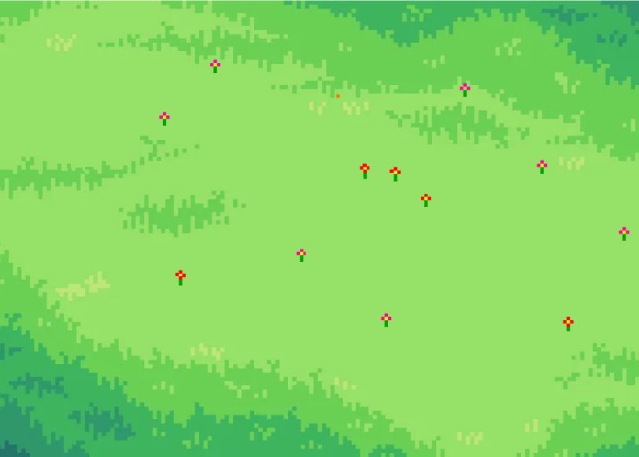

# GDD - Game Design Document - Módulo 1 - Inteli

## BIGODE'S

#### Nomes dos integrantes do grupo
- João de Caprio Agmont
- Paulo Vitor Barros de Almeida
- Isabela Rosati Peçanha
- Reimar Coelho Ferreira Filho
- Cauê Meyer Taddeo
- Thúlio Sallum Bacco Pinto
- Mariana Pereira de Souza 
- Henrique Rodrigues Diniz

## Sumário

[1. Introdução](#c1)

[2. Visão Geral do Jogo](#c2)

[3. Game Design](#c3)

[4. Desenvolvimento do Jogo](#c4)

[5. Casos de Teste](#c5)

[6. Conclusões e trabalhos futuros](#c6)

[7. Referências](#c7)

[Anexos](#c8)

 

# 1. Introdução 

## 1.1. Plano Estratégico do Projeto
- *Obs: todas as fontes utilizadas estão na seção 7.*

### 1.1.1. Contexto da indústria 
&nbsp;&nbsp;&nbsp;&nbsp;O mercado de comportamento e adestramento animal tem crescido com a alta demanda por métodos positivos. Os principais players incluem influenciadores, como Dr. Pet, Cesar Millan e Ian Dunbar, além de plataformas educacionais e empresas de produtos para pets. Os modelos de negócio variam entre consultorias, cursos online e assinaturas. Já as tendências no setor de cuidado de pets abrem margens para a gamificação e tecnologia. Alexandre Rossi busca inovação e diferenciação da concorrência ao abranger áreas de atuação como a mídia tradicional e as redes sociais, bem como a possível entrada no mercado de jogos digitais para animais domésticos [1], [2].

#### 1.1.1.1. Modelo de 5 Forças de Porter 

&nbsp;&nbsp;&nbsp;&nbsp;As 5 Forças de Porter são um modelo estratégico desenvolvido por Michael Porter, professor da Harvard Business School, na década de 1970. Este framework é amplamente utilizado para analisar a competitividade em um setor de negócios, identificando as principais forças que influenciam o ambiente competitivo de uma empresa. Ao analisar essas forças, é possível desenvolver estratégias eficazes para melhorar a posição competitiva da empresa no mercado. Sendo assim, a imagem a seguir apresenta a análise da indústria de comportamento e bem-estar de animais, a fim de averiguar como a marca Dr Pet se posiciona nesse setor [3], [4], [6].

 Figura X - 5 Forças de Porter

Fonte: Material produzido pelos autores (2025)

### 1.1.2. Análise SWOT

&nbsp;&nbsp;&nbsp;&nbsp;A análise SWOT é uma ferramenta estratégica que avalia o cenário interno e externo de uma empresa, identificando forças e fraquezas internas, além de oportunidades e ameaças externas. Isso inclui análises de mercado, concorrentes, fornecedores e contextos políticos, econômicos, sociais e culturais. Na figura, apresentamos a análise SWOT centrada na marca Dr Pet [3], [4], [5].

Figura X - Análise SWOT

Fonte: Material produzido pelos autores (2025)

&nbsp;&nbsp;&nbsp;&nbsp;A Dr. Pet se posiciona como uma marca consolidada e referência no mercado pet, apoiando-se na credibilidade de Alexandre Rossi e sua forte presença digital. No que tange à concorrência com influenciadores e métodos tradicionais de adestramento, é exigido diferenciação contínua para se destacar. Nesse contexto, sua presença em diferentes ambientes de influência, como redes sociais, mídias tradicionais e literatura educativa, coloca-a em vantagem em relação a seus oponentes. Oportunidades como a crescente demanda por adestramento positivo e a digitalização do setor podem fortalecer sua posição. Contudo, mudanças em algoritmos e regulações representam ameaças que exigem adaptação constante.

### 1.1.3. Missão / Visão / Valores 

&nbsp;&nbsp;&nbsp;&nbsp;A análise de Missão, Visão e Valores é uma ferramenta estratégica fundamental para qualquer empresa, pois ajuda a definir sua identidade e propósito. A Missão descreve o que a empresa faz atualmente, para quem ela trabalha e qual é seu objetivo principal. Ela serve como um guia para as operações diárias e define o papel da empresa no mercado. A Visão, por outro lado, estabelece o objetivo futuro, indicando onde a empresa deseja chegar a longo prazo. Ela inspira e motiva os funcionários a trabalhar em direção a um objetivo comum, ajudando a direcionar as estratégias e decisões da empresa [7].

&nbsp;&nbsp;&nbsp;&nbsp;Os Valores representam os princípios éticos e morais que guiam as ações e decisões da empresa. Eles influenciam a cultura organizacional e são essenciais para construir confiança com clientes, funcionários e parceiros. Essa análise é crucial para que as empresas mantenham uma direção clara e coerente, alinhando suas operações com seus objetivos e princípios. Dessa forma, esses fundamentos podem ser descritos para a marca Dr Pet da seguinte forma:

- Missão: democratizar o acesso aos serviços veterinários e de adestramentos para que os pets desfrutem do direito a uma vida tranquila e saudável;

- Visão: expandir a atuação através de serviços de qualidade que proporcionam uma experiência sempre positiva para os tutores e pets;

- Valores: excelência com simplicidade, credibilidade na transparência, atendimento com respeito e ética, ser sustentável em todos os aspectos.

### 1.1.4. Proposta de Valor 

*Posicione aqui o canvas de proposta de valor. Descreva os aspectos essenciais para a criação de valor da ideia do produto com o objetivo de ajudar a entender melhor a realidade do cliente e entregar uma solução que está alinhado com o que ele espera.*

### 1.1.5. Descrição da Solução Desenvolvida 

&nbsp;&nbsp;&nbsp;&nbsp;A solução desenvolvida consiste em um jogo interativo para gatos no iPad, projetado para estimular seus reflexos e proporcionar uma experiência envolvente tanto para os pets quanto para seus tutores. O jogo utiliza uma mecânica baseada no toque na tela, onde o gato deve acertar patas virtuais para avançar de fase. A cada nível, a dificuldade aumenta, introduzindo elementos como obstáculos e movimentação aleatória, tornando o desafio progressivamente mais complexo e estimulante.  

&nbsp;&nbsp;&nbsp;&nbsp;O diferencial da solução está na sua simplicidade e interatividade, garantindo uma experiência intuitiva para o gato e incentivando a participação ativa do tutor, que reforça o engajamento do pet oferecendo petiscos como recompensa física. O jogo foi pensado para alinhar-se às necessidades do mercado pet, proporcionando uma alternativa inovadora de entretenimento digital para animais de estimação.  

&nbsp;&nbsp;&nbsp;&nbsp;A solução agrega valor ao permitir que tutores ofereçam um estímulo mental e físico aos seus gatos, prevenindo o tédio e reforçando o vínculo entre pet e dono. Além disso, sua abordagem acessível e gamificada atende à crescente demanda por produtos tecnológicos voltados para o bem-estar animal.

### 1.1.6. Matriz de Riscos

*Registre na matriz os riscos identificados no projeto, visando avaliar situações que possam representar ameaças e oportunidades, bem como os impactos relevantes sobre o projeto. Apresente os riscos, ressaltando, para cada um, impactos e probabilidades com plano de ação e respostas.*

### 1.1.7. Objetivos, Metas e Indicadores 

 1.1.7.1. Qual é o objetivo do projeto?  

&nbsp;&nbsp;&nbsp;&nbsp;O objetivo do projeto é desenvolver um jogo interativo para gatos no iPad, que estimule seus reflexos e promova a interação entre os pets e seus tutores. O jogo deve ser intuitivo, engajador e progressivamente desafiador, garantindo uma experiência divertida para os gatos e incentivando o envolvimento dos tutores por meio de um sistema de recompensas físicas como petiscos.  

 1.1.7.2. Quais são as metas do projeto?  

&nbsp;&nbsp;&nbsp;&nbsp;Para garantir o sucesso do jogo, foram estabelecidas metas SMART (Específicas, Mensuráveis, Alcançáveis, Relevantes e Temporais).

1. Finalizar a primeira versão jogável (MVP) com a mecânica de toque e progressão de fases implementadas.  
2. Testar o jogo com pelo menos 10 gatos e seus tutores, avaliando engajamento e interatividade.
3. Otimizar a interface e design gráfico, melhorando a experiência visual e a responsividade do jogo. 
4. Lançar a versão beta para testes públicos, atingindo pelo menos 100 downloads. Prazo: 12 semanas.  
5. Alcançar uma taxa de engajamento de 70%, com gatos interagindo por pelo menos 2 minutos por sessão. 

 1.1.7.3. Como as metas serão medidas?  

&nbsp;&nbsp;&nbsp;&nbsp;As métricas de sucesso serão avaliadas por meio de testes práticos e dados quantitativos, analisando o engajamento dos gatos e a aceitação do jogo pelos tutores.  

- Teste com usuários reais: Observação do comportamento dos gatos e feedbacks quantitativos dos tutores.  
- Tempo médio de interação: Medição do tempo que os gatos passam jogando e a quantidade de toques bem-sucedidos.  
- Número de downloads e avaliações: Indicador do interesse e aceitação do jogo no mercado.  
- Taxa de retenção: Número de jogadores que voltam a utilizar o jogo após a primeira sessão.  

 1.1.7.4. Quais os benefícios da solução proposta?  
 
&nbsp;&nbsp;&nbsp;&nbsp;O jogo trará vantagens tanto para os gatos quanto para seus tutores, além de representar uma inovação no mercado pet.  

- Para os gatos: Estimulação mental e física, redução do tédio e incentivo ao instinto natural de caça.  
- Para os tutores: Uma ferramenta divertida e interativa para entreter seus pets, promovendo maior engajamento e reforço positivo.  
- Para o mercado pet: Introdução de um conceito inovador que pode ser expandido para novas plataformas e funcionalidades futuras.  

 1.1.7.5. Qual será o critério de sucesso e qual medida será utilizada para avaliá-lo?  

&nbsp;&nbsp;&nbsp;&nbsp;O sucesso será determinado pelo engajamento dos gatos, a satisfação dos tutores e a adoção do jogo no mercado.  

- Engajamento dos gatos: Pelo menos 70% dos gatos testados devem interagir com o jogo por 2 minutos ou mais por sessão.  
- Satisfação dos tutores: Feedback positivo de 80% dos tutores que testarem o jogo com seus pets.  
- Adoção do jogo: Alcançar 100 downloads na versão beta e manter uma avaliação média de 4 estrelas ou mais.  
- Aprimoramento contínuo: Implementação de ajustes baseados nos testes para tornar o jogo mais envolvente e eficiente.  

## 1.2. Requisitos do Projeto

&nbsp;&nbsp;&nbsp;&nbsp;Os requisitos do projeto representam as necessidades e expectativas essenciais que orientam seu desenvolvimento e execução. Eles estabelecem o que precisa ser alcançado, de que forma e sob quais condições. Esta seção abrange os requisitos funcionais e não funcionais, além dos aspectos técnicos, de qualidade e conformidade. Fundamentais para assegurar os objetivos, esses requisitos servem como base para o planejamento, implementação e avaliação do projeto.

Quadro X - Requisitos Fundamentais do Jogo

\# | Requisitos Fundamentais do Jogo
--- | ---
1 | O jogo deve ser publicável nas principais lojas de aplicativos
2 | O jogo deve funcionar em dispositivos móveis, como celulares e tablets
3 | O dispositivo móvel deve interpretar o toque da pata de gatos
4 | A descrição do jogo deve explicitar que ele é voltado para gatos
5 | O jogo deve apresentar responsividade para ter aparência adequada em diferentes tamanhos de tela
6 | O jogo deve indicar com clareza que o tutor é essencial para a jogabilidade
7 | Os elementos gráficos devem ser esticamente agradáveis ao público-alvo (humanos)
8 | O jogo deve indicar que o tutor deve preparar com antecedência petiscos para recompensar o gato
9 | O jogo deve apresentar diferentes fases que representam diferentes níveis de complexidade
10 | O jogo deve possuir uma interface intuitiva que mostre claramente que o jogo é estruturado em fases
11 | O tutor deve conseguir selecionar a fase que deseja que o gato jogue
12 | Após o tutor selecionar uma fase, deve aparecer uma pequena explicação sobre ela antes do jogo iniciar
13 | A primeira fase deve ser simples e introduzir as principais mecânicas do jogo
14 | O jogo deve apresentar um alvo que se comporte de modo a capturar a atenção do gato
15 | Os elementos gráficos do jogo devem apresentar cores visíveis para gatos
16 | Os alvos devem possuir cores que se destacam na visão dos gatos em relação aos outros elementos
17 | O alvo deve ser capaz de estimular os instintos de caça do gato
18 | O jogo deve apresentar estímulos visuais quando o gato tocar corretamente o alvo
19 | O jogo deve apresentar estímulos de sons de alta frequência quando o gato tocar corretamente o alvo
20 | O jogo deve apresentar vibração da tela quando o gato tocar corretamente o alvo
21 | O jogo deve apresentar opções de ativar ou desativar as mecânicas de som e vibração
22 | O background do jogo deve ser simples para não confundir o gato
23 | Os alvos devem ser "destruídos" após uma determinada quantidade pequena de toques 
24 | A quantidade de toques necessária para destruir o alvo deve progredir lentamente de acordo com as fases
25 | O jogo deve mostrar uma tela que indica que é o momento de recompensar o gato após todos os alvos serem destruídos
26 | O jogo deve fazer o gato associar a destruição dos alvos à recompensa
27 | O jogo deve indicar que o petisco deve ser posicionado na posição do último alvo destruído

Fonte: Material produzido pelos autores (2025)

Quadro X - Requisitos Desejáveis do Jogo

\# | Requisitos Desejáveis do Jogo
--- | ---
1 | O jogo deve apresentar uma mecânica nova para o alvo a cada fase
2 | As novas mecânicas devem desafiar cada vez mais as habilidades de caça do gato
3 | A mecâcina opcional do tutor controlar o alvo deve ser introduzida a fim de promover ainda mais interação entre tutor e pet
4 | O jogo deve apresentar a função de conectar dois dispositivos em uma mesma fase
5 | O jogo deve apresentar a função de um dispositivo atuar como controle remoto de um alvo que está em outro dispositivo

Fonte: Material produzido pelos autores (2025)

## 1.3. Público-alvo do Projeto

&nbsp;&nbsp;&nbsp;&nbsp;O jogo tem como público-alvo todos os donos de gatos que buscam formas inovadoras de entretenimento e estímulo para seus pets, especialmente aqueles que vivem em ambientes urbanos e utilizam tecnologia no dia a dia. Foi desenvolvido para proporcionar uma experiência interativa entre gatos e seus tutores, promovendo o enriquecimento ambiental e fortalecendo o vínculo entre ambos. Ao abranger esse público, independentemente da idade ou nível de experiência com tecnologia, busca-se garantir que os gatos tenham acesso a um jogo envolvente e adequado ao seu comportamento natural, enquanto os donos desfrutam de uma solução prática e intuitiva para estimular seus animais. O objetivo é incentivar momentos de diversão compartilhada, melhorar o bem-estar dos felinos e oferecer uma alternativa acessível e inovadora dentro do universo digital.

# 2. Visão Geral do Jogo

## 2.1. Objetivos do Jogo 

&nbsp;&nbsp;&nbsp;&nbsp;O jogador (gato) deve tocar no alvo presente na tela, com o objetivo de "destruí-lo" para ser recompensado, conforme o jogador completa as fases, o processo de recompensa fica mais complexo.

## 2.2. Características do Jogo 
&nbsp;&nbsp;&nbsp;&nbsp;O jogo pode ser decrito com cinco características principais que marcam sua jogabilidade:

- O jogo apresenta cinco fases;
- Cada nova fase apresenta alvos com movimentação mais rápida e padrões mais complexos;
- A cada fase, um novo desafio ou elemento é introduzido;
- Há animações ou efeitos especiais que ajudam a manter o jogador imerso;
- O jogador é recompensado pelo tutor após concluir com êxito uma fase.

### 2.2.1. Gênero do Jogo 

&nbsp;&nbsp;&nbsp;&nbsp;Jogo para gato.

### 2.2.2. Plataforma do Jogo 

&nbsp;&nbsp;&nbsp;&nbsp;Quanto ao dispositivo: smartphones e tablets.

&nbsp;&nbsp;&nbsp;&nbsp;Quanto ao sistema: disposítivos móveis que interpretam touch screen.

### 2.2.3. Número de jogadores 

&nbsp;&nbsp;&nbsp;&nbsp;1 ou 2 jogadores.

### 2.2.4. Títulos semelhantes e inspirações 

&nbsp;&nbsp;&nbsp;&nbsp;Temos como títulos semelhantes e inspirações os seguintes jogos: "Cat Toy 2", "Jogos para Gatos", "Meow jogos Para Gatos Filhotes".

### 2.2.5. Tempo estimado de jogo 

*Ex. O jogo pode ser concluído em 3 horas passando por todas as fases.*

*Ex. cada partida dura até 15 minutos*

# 3. Game Design 

## 3.1. Enredo do Jogo 

3.1. Enredo do Jogo 

&nbsp;&nbsp;&nbsp;&nbsp;Nosso jogo é focado em gatos e possui uma mecânica simples de tocar em alvos para ganhar pontos. Apesar de não possuir um enredo tradicional, todo jogo apresenta um contexto, um desafio e um cenário estruturado. Sendo assim, contextualizamos nosso jogo da seguinte forma:

- Contexto: O jogador e seu gato participam de um ambiente interativo projetado para estimular os instintos felinos, oferecendo desafios visuais e de reação;

- Objetivo: O gato deve interagir com os alvos que aparecem na tela para acumular pontos, enquanto o tutor acompanha e incentiva a interação;

- Cenário: O jogo ocorre em um ambiente amigável e estimulante, com variações visuais que criam uma experiência envolvente.

## 3.2. Personagens 

### 3.2.1. Controláveis

&nbsp;&nbsp;&nbsp;&nbsp;Nosso jogo não possui personagens controláveis, pois:

- Não há avatares ou personagens fictícios durante a jogabilidade – o próprio gato interage diretamente com os elementos na tela;

- O jogo é projetado para estimular o instinto de caça do gato, utilizando movimentos e efeitos visuais para incentivar a interação;

- A experiência é intuitiva e baseada no comportamento natural do animal, dispensando personagens jogáveis.

### 3.2.2. Non-Playable Characters (NPC)

&nbsp;&nbsp;&nbsp;&nbsp;Nosso personagem auxiliar se chama Canela, um gatinho que instrui o tutor sobre como jogar. Ele terá as seguintes funções:

- Tutorial: Ensinará ao tutor as mecânicas básicas do jogo;

- Acompanhamento: Estará presente na tela de níveis e explicará as diferentes fases do jogo;

- Auxílio visual: Fornecerá dicas para facilitar a jogabilidade.

  Concept Art do Canela  
   
  
    
  Fonte: Material produzido pelos autores (2025)

### 3.2.3. Diversidade e Representatividade dos Personagens

&nbsp;&nbsp;&nbsp;&nbsp;O jogo foi projetado para ser acessível tanto para os gatos quanto para os humanos, garantindo que a experiência seja envolvente e inclusiva. Para isso, foram consideradas diversas adaptações para daltônicos e surdos, garantindo que ninguém fique excluído da jogabilidade.

&nbsp;&nbsp;&nbsp;&nbsp;Acessibilidade para Daltônicos:

- Uso de cores contrastantes (ex: amarelo e azul) para facilitar a visualização tanto pelos gatos quanto pelos humanos daltônicos;

- Padrões e texturas distintas para diferenciar elementos visuais sem depender apenas de cores;

- Feedback visual reforçado com animações e efeitos luminosos para indicar interações bem-sucedidas.

&nbsp;&nbsp;&nbsp;&nbsp;Acessibilidade para Surdos:

- Sinais visuais de reforço positivo (brilhos, pequenas vibrações na tela, mudanças de cor ao acertar a pata);

- Ícones e expressões do Miau-trutor para substituir comandos sonoros e tornar as instruções mais claras.

## 3.3. Mundo do jogo 

### 3.3.1. Locações Principais e/ou Mapas 

&nbsp;&nbsp;&nbsp;&nbsp;O jogo se passa em um ambiente virtual projetado para maximizar a interação do gato. As principais locações incluem:
\# | Local | Descrição
--- | --- | ---
1 | Tela Inicial | Área onde o tutor pode acessar o jogo e selecionar os modos de jogo. |
2 | Fases de Caça | Diferentes cenários em que os alvos aparecem, estimulando o gato a caçá-los. |
3 | Menu de Configuração | Permite ajustar elementos como som, cores e níveis de dificuldade. |

### 3.3.2. Navegação pelo mundo 

&nbsp;&nbsp;&nbsp;&nbsp;A navegação no jogo é simples e direta:

- 1. O tutor escolhe o nível e inicia o jogo;
- 2. O gato interage com os alvos na tela, gerando pontuações e efeitos visuais;
- 3. Conforme avança, novas fases e desafios são desbloqueados automaticamente.

### 3.3.3. Concept Art 

&nbsp;&nbsp;&nbsp;&nbsp;Uma concept art é a essência visual de uma ideia, ela explica a atmosfera onde o jogo se passará, os personagens presentes e as fases. Ele será um reflexo de nosso processo criativo, evidenciando que passos tomamos para a criação do design de nosso jogo. O link abaixo apresenta um arquivo que aborda o processo da criação das concepts arts do nosso jogo.

- https://www.figma.com/design/cVbJo00x8BpZQIv578cxQV/Figma-basics?m=dev&t=5ewIVfxGBBk5PlOo-1

### 3.3.4. Trilha sonora 

&nbsp;&nbsp;&nbsp;&nbsp;A trilha sonora de um jogo é tão essencial quanto a própria jogabilidade, uma vez que influencia as emoções dos jogadores, fazendo-os criar uma conexão com o jogo. Portanto ao selecionar os áudios e efeitos sonoros, foram tomados cuidados extras, para não prejudicar a concepção do jogo e ornando com a proposta do mesmo.
&nbsp;&nbsp;&nbsp;&nbsp;Ao pensar sobre a trilha sonora, destacou-se a preferência por algo mais chamativo, a fim de "dar a cara" para o jogo através da unicidade da música. Foi decidido também a adição de efeitos sonoros para certas funcionalidades, como: clique dos botôes (configuração, play, etc...), destruição da pata e da pata se movimentando.

\# | titulo | ocorrência | autoria 
--- | --- | --- | ---
1 | "Vacation with my cat" | Trilha principal | <a href = "https://pixabay.com/music/upbeat-vacation-with-my-cat-248359/"> Pixabay (AI generated) </a>
2 | Light Switch | Clique dos botões | <a href = "https://freesound.org/people/GOSFX/sounds/324334/"> GOSFX </a>
3 | "meow meow give me milk Version 1" | Trilha sonora da seleção de fases | <a href = "https://pixabay.com/pt/music/musicas-felizes-para-criancas-meow-meow-give-me-milk-version-1-317260/"> Pixabay (AI generated) </a>
4 | "me dá me dá" - piano cover | XXXXXXXXXXXX | Cover da propaganda do 'danoninho' ("me dá me dá")
5 | TIN | Clique na pata | Autoral
6 | Prato de bateria | XXXXXXXXXXXXXX | Autoral
7 | Botão de elevador | Clique dos botões | Autoral
8 | Folhas | Esconderijo da pata | Autoral
9 | "Bink no Sake" - piano cover | Pata se movimentando | Cover influcenciado pela música "Bink no Sake" (One Piece)
10 | Chocalho | XXXXXXXXXX | Autoral

## 3.4. Inventário e Bestiário 

### 3.4.1. Inventário

&nbsp;&nbsp;&nbsp;&nbsp;Um inventário em jogos é um sistema que permite ao jogador armazenar, organizar e utilizar itens adquiridos ao longo da gameplay. Ele pode conter objetos essenciais para progressão, como armas, recursos, moedas ou equipamentos, dependendo do gênero do jogo. O inventário pode ser acessado a qualquer momento e geralmente envolve mecânicas de gestão de recursos, coleta de itens e uso estratégico de elementos dentro do jogo.

&nbsp;&nbsp;&nbsp;&nbsp;O nosso jogo não possui um sistema de inventário porque sua mecânica central é baseada na interação direta do gato com a tela, sem necessidade de armazenar itens para uso posterior. 

### 3.4.2. Bestiário

Um bestiário em jogos é um compêndio que reúne informações sobre as criaturas encontradas ao longo da gameplay. Ele pode incluir descrições, imagens, fraquezas, habilidades e contexto dentro da história, ajudando o jogador a entender melhor os inimigos ou seres presentes no mundo do jogo. Muitas vezes, o bestiário é desbloqueado progressivamente, conforme o jogador enfrenta ou derrota novas criaturas.  

Nosso jogo não possui um sistema de bestiário porque seu foco está em uma dinâmica simples de interação entre o gato e um elemento despersonalizado na tela, portanto, não utiliza do artifício de introduzir criaturas antogonistas ao jogador para gerar desafio.

## 3.5. Gameflow (Diagrama de cenas) 

&nbsp;&nbsp;&nbsp;&nbsp;Um diagrama de cenas para um jogo representa visualmente a transição entre diferentes telas ou estados, como menus, fases e cutscenes. Ele auxilia no planejamento da navegação, garantindo uma experiência fluida para o jogador e facilitando a organização do desenvolvimento. O link abaixo contém um arquivo que apresenta o diagrama de cenas do nosso jogo.

- https://www.figma.com/design/luhoZeSsvZhyLUqD8fNmj2/Figma-basics?node-id=1669-162202&m=dev&t=ip24dGcWd0Ux4PSl-1*

## 3.6. Regras do jogo 

&nbsp;&nbsp;&nbsp;&nbsp;As regras do jogo definem o início, o progresso dos jogadores, as ações possíveis e o desfecho do jogo, sendo fundamentais para garantir que o usuário entenda com clareza a jogabilidade e, assim, tenha uma boa experiência ao jogar. Desse modo, foram estabelecidas as seguintes regras para o jogo "Paw Dash":

1. Regras Gerais
- O usuário deve concluir as fases de modo que, após ter êxito na primeira, poderá jogar a segunda, e assim por diante;
- O usário (gato) deve tocar corretamente no alvo para ser recompensado;
- o usuário (tutor) deve estar preparado para recompensar o gato quando ele obtver êxito no jogo.

2. Fase 1
- O alvo deve se movimentar através de uma trajetória circular, e o gato deve ser recompensado sempre que tocar corretamente o alvo, de modo a aprender a relação entre o toque e a recompensa.

3. Fase 2
- O alvo deve se mover "rebatendo" nas bordas da tela, e o gato deve ser recompensado após acertar o alvo três vezes.

4. Fase 3
- O alvo deve se mover como na fase 2, mas após o gato acertá-lo uma vez, ele deve se dividir em dois alvos menores que poderão ser destruídos após dois toques, e assim o gato poderá ser recompensado. (Fase em revisão)

&nbsp;&nbsp;&nbsp;&nbsp;A partir dessas regras, os usuários (tutor e gato) poderão aproveitar plenamente a experiência oferecida pelo jogo.

## 3.7. Mecânicas do jogo 

&nbsp;&nbsp;&nbsp;&nbsp;As mecânicas de um jogo dizem respeito ao conjunto de interações que possibilitam a realização de ações e a progressão dentro da experiência do jogador. O propósito dessas mecânicas é oferecer desafios, entretenimento e uma experiência imersiva, permitindo que os jogadores explorem o que o jogo oferece, atinjam objetivos e superem obstáculos dentro do contexto definido pelas metas do jogo. Com isso em mente, para garantir uma mecânica intuitiva, de fácil uso para os gatos e que apresentasse uma progressão de dificuldade, as interações do jogo ocorrem por meio do toque, ação mais adequada para os felinos interagirem com a tela, ou seja, o gato interaje com os alvos, elementos principais da jogabilidade, tocando-os. Assim, o desafio ao usuário aumenta a medida que os alvos se movem de forma mais complexa, o que torna mais difícil acertá-los. Ademais, as interações feitas pelo tutor também ocorrem pelo toque, como a seleção de níveis.

## 3.8. Implementação Matemática de Animação/Movimento 

*Descreva aqui a função que implementa a movimentação/animação de personagens ou elementos gráficos no seu jogo. Sua função deve se basear em alguma formulação matemática (e.g. fórmula de aceleração). A explicação do funcionamento desta função deve conter notação matemática formal de fórmulas/equações. Se necessário, crie subseções para sua descrição.*

# 4. Desenvolvimento do Jogo

## 4.1. Desenvolvimento preliminar do jogo 

&nbsp;&nbsp;&nbsp;&nbsp;Para a primeira versão do jogo em termos de código, selecionamos as mecânicas e dinâmicas mais importantes da jogabilidade, bem como alguns elementos cruciais da estética escolhida, como o modelo de uma pata (alvo principal do gato) em pixel art, para desenvolver uma tela que demonstra a essência do nosso projeto. Desse modo, as etapas desenvolvidas preliminarmente, bem como os desafios encontrados e a projeção para o futuro do projeto, podem ser definidos pelos tópicos seguintes.

### **4.1.1. Estética**

&nbsp;&nbsp;&nbsp;&nbsp;Para compor os elementos estéticos iniciais do nosso jogo, desenvolvemos em pixel art a representação de uma pata de gato (figura X), que atua no jogo como alvo tocável para o gato usuário. Ademais, foi selecionado um background que consiste na representação de uma parede de madeira (figura X).

  Figura X - Pata desenvolvida em pixel art  
   
  
    
  Fonte: Material produzido pelos autores (2025)

  Figura X - Background de Madeira  
   
  
    
  Fonte: Imagem em Domínio Público

### **4.1.2. Mecânicas**

&nbsp;&nbsp;&nbsp;&nbsp;As principais mecânicas elaboradas no primeiro estágio de desenvolvimento do jogo foram as seguintes:
- A pata se move verticalmente e horizontalmente através da tela e muda de direção sempre que colide com uma “parede”;
- A pata é clicável, reage diminuindo de tamanho a cada clique e aumenta de velocidade ao atingir um tamanho mínimo pré definido;
- O número de cliques bem sucedidos é contabilizado e mostrado na tela;
- O background se adapta de acordo com o tamanho da tela onde o jogo está sendo jogado.

### **4.1.3 Dificuldades Encontradas**

&nbsp;&nbsp;&nbsp;&nbsp;Os principais desafios encontrados durante o desenvolvimento do jogo foram os seguintes:
- Dificuldade em captar precisamente os cliques na tela, o que pode ser um empecilho, haja vista que os toques dos gatos podem ser suaves e não serem captados adequadamente para uma jogabilidade fluída; 
- Dificuldade em configurar a pata para que ela se divida após um número determinado de cliques, o que é uma das mecânicas principais pensadas para o jogo;
- Desconhecimento sobre a real capacidade de nosso jogo de captar a atenção de felinos, de modo que não temos certeza se nossa abordagem irá ser efetiva em primeira análise.

### 4.1.4 Próximos passos

&nbsp;&nbsp;&nbsp;&nbsp;Pensando nas próximas etapas de desenvolvimento do nosso projeto, os próximos passos planejados para serem executados nos próximos Sprints são os seguintes:
- Otimizar a mecânica de capturar toques na tela e testar seu funcionamento em dispositivos móveis;
- Desenvolver uma tela que instrua o tutor a recompensar o gato de acordo com seu sucesso e de maneira adequada;
- Adicionar sons e efeitos visuais envolventes para otimizar a capacidade de engajar os usuários;
- Testar a jogabilidade com um grupo de gatos para coletar feedback para ajustes;
- Desenvolver a tela inicial do jogo, a tela de seleção de fases, bem como as demais funcionalidades para tornar nosso aplicativo completo;
- Adicionar funcionalidades diferenciais para atender o requisto de proporcionar uma experiência inovadora e cativante entre tutor e animal.

## 4.2. Desenvolvimento básico do jogo 

&nbsp;&nbsp;&nbsp;&nbsp;Para a versão básica do jogo em termos de código, focamos em desenvolver as mecânicas e dinâmicas referentes a primeira fase do jogo, no caso, o tutorial, bem como a interface inicial e a tela de fases. Desse modo, as etapas desenvolvidas nessa sprint, bem como os desafios encontrados e a projeção para o futuro do projeto, podem ser definidos pelos tópicos seguintes.

### **4.2.1. Estética**

&nbsp;&nbsp;&nbsp;&nbsp;Para compor a interface incial, a tela de fases e o fundo do tutorial, desenvolvemos em pixel art backgrounds da tela de níveis e do jogo em si para substituir o fundo de madeira(figuras X e X), botões da tela inicial e para cada fase (figuras X). Ademais, foi desenvolvida uma logo para nosso projeto (figura X).

  Figura X - Background da Tela de Fases  
   
  
    
  Fonte: Freepik [AA]

  Figura X - Background do Nível  
   
  
    
  Fonte: Material produzido pelos autores (2025)

  Figura X - Botões  
   
  
    
  Fonte: Material produzido pelos autores (2025)

  Figura X - Logo  
   
  
    
  Fonte: Material produzido pelos autores (2025)

### **4.2.2. Mecânicas**

&nbsp;&nbsp;&nbsp;&nbsp;As principais mecânicas elaboradas no segundo estágio de desenvolvimento do jogo foram as seguintes:
- A pata se move em uma trajetória circular e lenta na fase de tutorial;
- É possível navegar pelas telas e até mesmo acessar as fases 1 e 2 na tela de níveis;
- Além disso, partes singulares de mecânicas de outras fases foram desenvolvidas indidualmente, mas não são funcionais ainda, como um movimento mais fluído para a fase 2.

### **4.2.3 Dificuldades Encontradas**

&nbsp;&nbsp;&nbsp;&nbsp;Os principais desafios encontrados durante o desenvolvimento do jogo foram os seguintes:
- Dificuldade em estruturar teoricamente e no código o funcionamento da instrução de recompensa; 
- Dificuldade em configurar o jogo para que ele se comporte de maneira adequada em dispositivos móveis, como ele se comporta na web;
- Dificuldade em programar um jogo que possa ser testado de maneira adequada com gatos.

### 4.2.4 Próximos passos

&nbsp;&nbsp;&nbsp;&nbsp;Pensando nas próximas etapas de desenvolvimento do nosso projeto, os próximos passos planejados para serem executados nos próximos Sprints são os seguintes:
- Otimizar as fases já em desenvolvimento avançado para que possam ser testadas;
- Desenvolver uma tela que instrua o tutor a recompensar o gato de acordo com seu sucesso e de maneira adequada;
- Adicionar sons e efeitos visuais envolventes para otimizar a capacidade de engajar os usuários;
- Testar a jogabilidade com um grupo de gatos para coletar feedback para ajustes;
- Planejar como iremos implementar as demais mecânicas propostas para nosso projeto.

## 4.3. Desenvolvimento intermediário do jogo 

&nbsp;&nbsp;&nbsp;&nbsp;Para a versão intermediária do jogo em termos de código, focamos em desenvolver funcionalmente as fases 2 e 3, bem como tornar elas apresentáveis, com os novos assests desenvolvidos ou reformulados, junto do tutorial. Além disso, houve uma grande reformulação na forma como nosso código estava estruturado, de modo que agora nossas fases estão contidas em cenas e a transição entre as telas ocorre de forma mais adequada. Dessa forma, as etapas desenvolvidas nesta sprint, os desafios encontrados e a projeção para o futuro do projeto podem ser descritos nos tópicos seguintes.

### **4.3.1. Estética**

&nbsp;&nbsp;&nbsp;&nbsp;Para compor a interface geral do jogo, foram criados, retrabalhados ou escolhidos backgrounds, sendo alguns definitivos e outros provisórios. As imagens a seguir ilustram os elementos visuais implementados nesta sprint:

  Figura X - Background Retrabalhado  
   
  
    
  Fonte: Material produzido pelos autores (2025)

  Figura X - Background Provisório da Tela de Níveis  
   
  
    
  Fonte: 2D Game Assets (2024) [AB]

  Figura X - Background Provisório do Menu  
   
  
    
  Fonte: (A definir)

### **4.3.2. Mecânicas**

&nbsp;&nbsp;&nbsp;&nbsp;As principais mecânicas elaboradas nesta etapa do desenvolvimento do jogo foram as seguintes:
- Em todas as fases já prontas, ao atingir o número pré-determinado de toque necessários para destruir o alvo, o jogo instrui o tutor a colocar a recompensa no local onde a pata foi destruída;
- Na fase 1, o alvo se move circularmente, mas agora com um raio um pouco maior para o gato não tocar apenas no meio da tela;
- Na fase 2, o alvo "rebate" nas bordas e apresenta a mesma dinâmica de recompensa após um toque da primeira fase;
- Na fase 3, o alvo se divide em dois ao ser acertado uma vez, e suas cópias devem ser atingidas mais duas vezes para a recopensa ser dada, contudo, essa fase está em revisão pois é possível que os gatos se confundam muito com dois alvos simultâneos;

&nbsp;&nbsp;&nbsp;&nbsp;A figura abaixo ilustra como a instrução de recompensa está implementada no jogo:

  Figura X - Instrução de Recompensa  
   
  
    
  Fonte: Paw Dash (2025)

### **4.3.3. Dificuldades Encontradas**

&nbsp;&nbsp;&nbsp;&nbsp;Os principais desafios encontrados durante o desenvolvimento do jogo nesta sprint foram os seguintes:
- Novamente, desenvolver nosso jogo de modo que ele funcione em diferentes dispositivos foi um desafio;
- A estruturação de nosso jogo em classes foi trabalhosa, pois fizemos primeiro de uma maneira diferente, e a adequação para o novo modelo exigiu tempo e grandes mudanças no código;

### **4.3.4 Próximos passos**

&nbsp;&nbsp;&nbsp;&nbsp;Pensando nas próximas etapas de desenvolvimento do projeto, os próximos passos planejados para as próximas sprints são os seguintes:
- Aumentar o tamanho do alvo, pois, ao testarmos nosso jogo, percebemos que nem sempre o gato conseguia visualizar claramente o alvo;
- Desenvolver o alvo em diferentes cores para testarmos quais são mais efetivas;
- Desenvolver mais uma ou duas fases, conforme nossa capacidade, que diferenciem nosso jogo dos demais;
- Garantir que nosso jogo funcione em dispositivos móveis, a principal plataforma escolhida;
- Implementar a trilha sonora do jogo;
- Retrabalhar alguns designs que não agradaram nossa equipe no geral.

## 4.4. Desenvolvimento final do MVP 

&nbsp;&nbsp;&nbsp;&nbsp;Para a versão final do jogo em termos de código, focamos em refinar e otimizar as funcionalidades que já tinhamos, como a fase de tutorial, com base no que agradou o parceiro, bem como tornar elas responsivas. Nesse sentido, descontinuamos fases que continham mecânicas muito complexas, como a divisão de pata e o controle remoto do alvo pelo tutor, e demos enfâse nas fases simples: tutorial, movimento aleátório e obstáculos. Além disso, de forma adicional, trabalhamos na versão inicial de um dispositivo voltado a automatizar a dinâmica de recompensa. Dessa forma, as etapas desenvolvidas nesta sprint, os desafios encontrados e a projeção para o futuro do projeto podem ser descritos nos tópicos seguintes.

### **4.4.1. Estética**

&nbsp;&nbsp;&nbsp;&nbsp;Para incrementar a experiência do nosso jogo, desenvolvemos efeitos sonoros de modo autoral para uma jogabilidade mais completa (para mais detalhes, veja a [seção 3.3.4](#som)). Além disso, construímos uma animação inicial, conforme a figura X, para nosso jogo, que apresenta o nome da equipe de desenvolvimento.

  Figura X - Introdução da Equipe  
   
  
    
  Fonte: Material produzido pelos autores (2025)

### **4.4.2. Mecânicas**

&nbsp;&nbsp;&nbsp;&nbsp;As principais mecânicas elaboradas nesta etapa do desenvolvimento do jogo foram as seguintes:
- Na fase 1, o alvo se move em formato de "infinito", um pouco mais imprevisível que o movimento definido anteriormente;
- Na fase 3, o alvo não pode ser clicado quando está atrás dos obstáculos e rebate em outros elementos além da borda;
- O jogo se adapta conforme o tamanho da tela do dispostivo e apresenta um visual melhor em dispositivos móveis;
- O jogo indica ao usuário girar a tela do dispositivo para a posição mais adequada para o jogo.

&nbsp;&nbsp;&nbsp;&nbsp;Já as mecânicas retiradas do jogo foram as seguintes:
- O alvo se dividia em dois ao ser acertado uma vez, e suas cópias deviam ser atingidas mais duas vezes para a recopensa ser dada;
- Na fase 1, o alvo se movia de maneira circular e muito previsível.

&nbsp;&nbsp;&nbsp;&nbsp;As figuras abaixo ilustram a fase 3 (obstáculos) e o aviso para rotacionar a tela:

  Figura X - Fase 3  
   
  
    
  Fonte: Paw Dash (2025)

  Figura X - Aviso de Rotação  
   
  
    
  Fonte: Paw Dash (2025)

### **4.4.3. Dificuldades Encontradas**

&nbsp;&nbsp;&nbsp;&nbsp;Os principais desafios encontrados durante o desenvolvimento do jogo nesta sprint foram os seguintes:
- Entender quais funcionalidades seriam mais atrativas para os gatos sem testes frequentes;
- Tornar o jogo adaptável a todos os tipos de dispositivos;
- Implementar o desafio proposto pelo artefato voltado à matemática;
- Complexidade do código devido a quantidade de incrementos adicionados.

### **4.4.4 Próximos passos**

&nbsp;&nbsp;&nbsp;&nbsp;Pensando nas próximas etapas de desenvolvimento do projeto, os próximos passos planejados para a próxima sprint são os seguintes:
- Testar o jogo tanto com tutores quanto com gatos, a fim de coletar feedbacks e tratar possíveis erros de execução;
- Caso possível, prosseguir com a dinâmica de recompensa automatizada para torná-la parte do MVP;
- Revisar toda a documentação a fim de alinhá-la com a versão final do nosso jogo.

## 4.5. Revisão do MVP 

*Descreva e ilustre aqui o desenvolvimento dos refinamentos e revisões da versão final do jogo, explicando brevemente o que foi entregue em termos de MVP. Utilize prints de tela para ilustrar.*

# 5. Testes

## 5.1. Casos de Teste

&nbsp;&nbsp;&nbsp;&nbsp;Os seguintes casos de teste foram elaborados para verificar o funcionamento correto do jogo e a integração de suas partes. Cada teste garante que os requisitos fundamentais sejam atendidos e que a experiência de jogo seja fluida e funcional.

Quadro X - Casos de Teste

\# | Pré-condição | Descrição do teste | Pós-condição 
--- | --- | --- | --- 
1 | O jogo deve estar instalado e aberto na tela inicial | Selecionar uma fase e iniciar o jogo | A fase correspondente deve ser carregada corretamente
2 | O jogo deve estar em execução | O jogador deve tocar no alvo corretamente | O alvo deve apresentar o mesmo tempo de resposta ao toque (latência inferior a X ms) e suavidade de animação (FPS mínimo de Y) em diferentes dispositivos
3 | O jogo deve estar em execução com os gráficos ajustados | Verificar a estética dos elementos gráficos | O contraste e a saturação das cores devem atender ao padrão X para visibilidade felina, garantindo uma experiência visual agradável para o tutor
4 | O jogo deve estar aberto na tela de início | Apertar o botão "play" | O jogo deve abrir a tela de níveis
5 | O jogo deve estar aberto na tela de níveis | Apertar o botão de um nível específico (ex.: "nível 1", "nível 2" ou "nível 3") | A aba correspondente ao nível deve ser carregada corretamente
6 | O jogo deve estar aberto no nível tutorial | Apertar na pata que gira em torno dela mesma | Um texto explicativo e uma marcação vermelha devem aparecer indicando onde o tutor deve colocar o petisco
7 | O jogo deve estar aberto no nível 2 | Apertar na pata que se movimenta pelo espaço de forma aleatória 3 vezes | Um texto explicativo e uma marcação vermelha devem aparecer indicando onde o tutor deve colocar o petisco
8 | O jogo deve estar aberto no nível 3 | Apertar na pata que se move de forma aleatória pelo espaço | Duas novas patas menores devem ser carregadas corretamente para que continuem a se mover de forma aleatória
9 | As patas devem ter se dividido em duas novas patas menores | Apertar duas vezes em cada pata menor | Um texto explicativo e uma marcação vermelha devem aparecer indicando onde o tutor deve colocar o petisco
10 | A recompensa deve ter sido dada | Apertar o botão de "voltar" localizado no canto inferior direito da tela | O jogo deve retornar à tela de níveis

Fonte: Material produzido pelos autores (2025)

&nbsp;&nbsp;&nbsp;&nbsp;Estes testes garantem que o jogo funcione conforme os requisitos estabelecidos e proporcione uma experiência envolvente tanto para os gatos quanto para seus tutores.

## 5.2. Testes de jogabilidade (playtests) 

### 5.2.1 Registros de testes

*Descreva nesta seção as sessões de teste/entrevista com diferentes jogadores. Registre cada teste conforme o template a seguir.*

Quadro X - Registro de Testes

Nome | João Jonas (use nomes fictícios)
--- | ---
Já possuía experiência prévia com games? | sim, é um jogador casual
Conseguiu iniciar o jogo? | sim
Entendeu as regras e mecânicas do jogo? | entendeu as regras, mas sobre as mecânicas, apenas as essenciais, não explorou os comandos complexos
Conseguiu progredir no jogo? | sim, sem dificuldades  
Apresentou dificuldades? | Não, conseguiu jogar com facilidade e afirmou ser fácil
Que nota deu ao jogo? | 9.0
O que gostou no jogo? | Gostou  de como o jogo vai ficando mais difícil ao longo do tempo sem deixar de ser divertido
O que poderia melhorar no jogo? | A responsividade do personagem aos controles, disse que havia um pouco de atraso desde o momento do comando até a resposta do personagem

Fonte: Material produzido pelos autores (2025)

### 5.2.2 Melhorias

*Descreva nesta seção um plano de melhorias sobre o jogo, com base nos resultados dos testes de jogabilidade*

# 6. Conclusões e trabalhos futuros 

*Escreva de que formas a solução do jogo atingiu os objetivos descritos na seção 1 deste documento. Indique pontos fortes e pontos a melhorar de maneira geral.*

*Relacione os pontos de melhorias evidenciados nos testes com plano de ações para serem implementadas no jogo. O grupo não precisa implementá-las, pode deixar registrado aqui o plano para futuros desenvolvimentos.*

*Relacione também quaisquer ideias que o grupo tenha para melhorias futuras*

# 7. Referências 

[1] ROSSI, Alexandre. Sobre nós. Disponível em: https://doutorpet.com/sobre-nos/. Acesso em: 12 fev. 2025.

[2] ROSSI, Alexandre. Instagram oficial. Disponível em: https://www.instagram.com/alexandrerossi_oficial/?hl=en. Acesso em: 12 fev. 2025.

[3] O GLOBO. Petz compra franquia do Dr. Pet e projeta 50 novas lojas para 2022. Disponível em: https://oglobo.globo.com/economia/negocios/petz-compra-franquia-do-dr-pet-projeta-50-novas-lojas-para-2022-25270397. Acesso em: 27 fev. 2025.

[4] DOOGS PET. Como funciona o mercado de adestramento de cães no Brasil. Disponível em: https://doogspet.com/dicas/como-funciona-o-mercado-de-adestramento-de-caes-no-brasil/. Acesso em: 27 fev. 2025.

[5] ROCK CONTENT. Como fazer uma análise SWOT. Disponível em: https://rockcontent.com/br/blog/como-fazer-uma-analise-swot/. Acesso em: 27 fev. 2025.

[6] SALESFORCE. As 5 forças de Porter: o que são e como usá-las? Disponível em: https://www.salesforce.com/br/blog/5-forcas-de-porter/. Acesso em: 25 fev. de 2025.

[7] MEREO. Missão, visão e valores: o que é, como definir e exemplos. Disponível em: https://mereo.com/blog/missao-visao-e-valores/. Acesso em: 25 fev. de 2025.

[AA] BRONWENSTUDIO. Fundo de paisagem rural de pixel art. 2024. Disponível em: https://br.freepik.com/vetores-gratis/fundo-de-paisagem-rural-de-pixel-art_49685499.htm. Acesso em: 23 fev. 2025.

[AB] 2D GAME ASSETS. Forest and Trees - Free Pixel Backgrounds. Dribbble, 2024. Disponível em: https://dribbble.com/shots/24653940-Forest-and-Trees-Free-Pixel-Backgrounds. Acesso em: 14 mar. 2025.

# Anexos

*Inclua aqui quaisquer complementos para seu projeto, como diagramas, imagens, Quadros etc. Organize em sub-tópicos utilizando headings menores (use ## ou ### para isso)*
